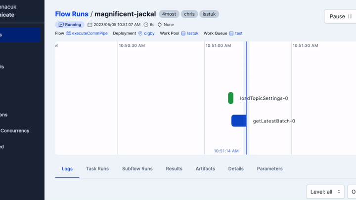

# TiDES Communication Pipeline

The goal of this repository is to establish a communication infrastructure to orchestrate the discovery of transients from various astronomical surveys (LSST, ZTF, etc.), align them via a database cross-matching process, and feed these objects to the 4MOST Transients API.



---

## 1. Pipeline Architecture & Execution Order

The ingestion pipeline is designed to be highly modular and survey-agnostic. Everything is orchestrated by Prefect flows. When the pipeline runs, it executes in the following order:

1. **Orchestration (`tides_controller.py`)**: The `run_target_workflow` flow is triggered. It loads credentials and initializes the database connection.
2. **Stream Fetching (Survey Plugins)**: The controller sequentially calls survey-specific plugins (e.g., `fetch_lsst_targets()` from `tides_lsst.py`). These plugins connect to external Kafka streams (like Lasair), parse incoming alerts, compute standard magnitude fluxes, and return a standardized Pandas DataFrame.
3. **Staging**: The controller pushes the standardized DataFrame into a temporary PostgreSQL table (`tides_stage`).
4. **Cross-Matching & Upsert (`upsertTiDESstage.sql`)**: 
   - A 1-arcsecond spatial cross-match (`q3c_radial_query`) is performed against the `tides_master` database table.
   - If a transient already exists, its new magnitude metadata is merged (`COALESCE`) into the JSONB dictionary without overwriting historical data from other surveys.
   - If it's a new transient, a new TiDES ID (e.g., `TiDES26aaa`) is generated via a sequence trigger.
5. **Junction Mapping**: The target is logged in the `surveys` and `pipeline_selections` junction tables to track which surveys observed it.
6. **4MOST API Sync**: Newly matched or updated transients are sent to the 4MOST operational API.

---

## 2. Setup and Installation

### Requirements
Ensure you have the following installed in your Python environment:
```text
prefect
prefect_dask
lasair
pandas
numpy
sqlalchemy
psycopg2
python-dotenv
submit_transients (proprietary 4MOST API)
```

### Database Configuration
You must configure a PostgreSQL database. Ensure the `q3c` spatial indexing extension is installed in your Postgres environment.

1. Create a `.env` file in the root directory (use `.env.example` as a template) and add your database credentials:
```env
TIDES_DB_USER='username'
TIDES_DB_PASS='password'
TIDES_DB_DATABASE='tides_db'
TIDES_DB_PORT='5432'
TIDES_DB_HOST='127.0.0.1'
```

2. Run the initial database setup script. This will construct the schema, the master tables, junction tables, and triggers.
```bash
cd database_setup
./setupDB.sh
```

---

## 3. Running the Code

### Manual Run / Development
To test the pipeline manually, you can execute the controller directly:
```bash
python opr4_flows/tides_controller.py
```
*(Note: Refer to `testing/README.md` for instructions on using `test_mode` to safely simulate and debug deterministic data streams without requiring live Kafka streams.)*

### Prefect Deployment
For production, you should build a Prefect deployment to run the code as an automated flow:

1. Build the deployment:
```bash
prefect deployment build -n tides-ingest -p lsstuk -q default opr4_flows/tides_controller.py:run_target_workflow
```
2. Edit the generated `run_target_workflow-deployment.yaml` to configure scheduling (like a cronjob).
3. Apply the deployment:
```bash
prefect deployment apply run_target_workflow-deployment.yaml
```

---

## 4. Plugin Guide: Adding a New Survey Stream

To connect a new survey stream (e.g., ATLAS) to the TiDES pipeline, you don't need to rewrite the core SQL logic. Follow these steps:

### Step A: Create the Survey Plugin
Create a new file `opr4_flows/tides_atlas.py`. Write a function (e.g., `fetch_atlas_targets()`) that connects to your stream and returns a **Pandas DataFrame** containing EXACTLY these columns:

| Column Name | Type | Description |
|---|---|---|
| `object_id` | String/Int | The original ID from the survey (e.g., `ATLAS24abc`). |
| `survey_id` | Int | The internal TiDES survey ID (see Step B). |
| `pipeline_id` | Int | Internal TiDES pipeline ID (usually `1`). |
| `ra` | Float | Right Ascension in decimal degrees. |
| `dec` | Float | Declination in decimal degrees. |
| `jdmin` | Float | Julian Date of first detection. |
| `jdmax` | Float | Julian Date of latest detection. |
| `latest_filter` | JSON String | JSON dictionary of the latest observation date per filter (e.g., `json.dumps({"c_atlas": 61050.0})`). |
| `latest_mag` | JSON String | JSON dictionary of the computed magnitude per filter (e.g., `json.dumps({"c_atlas": 19.5})`). |
| `n_sources` | JSON String | JSON dictionary of the number of detections per filter. |

### Step B: Register the Survey ID
You must register the new survey in the database. Open `database_setup/surveyIDs.sql` and add your survey:
```sql
INSERT INTO survey_names (survey_id, survey_name) VALUES
    (3, 'ATLAS')
ON CONFLICT (survey_id) DO NOTHING;
```

### Step C: Hook it into the Controller
Finally, open `opr4_flows/tides_controller.py` and modify the `run_target_workflow` function to call your new plugin:

```python
# 1. Import your plugin at the top
from tides_atlas import fetch_atlas_targets

# ... inside run_target_workflow() ...
# 2. Call your plugin
atlas_targets = fetch_atlas_targets(engine=engine)

# 3. Append to the sequence
allSourceSurveys.append(atlas_targets)
```

The TiDES pipeline will automatically handle the rest: staging the data, executing spatial cross-matching, updating existing objects, inserting new ones, generating `TiDES` IDs, and sending everything to 4MOST!
