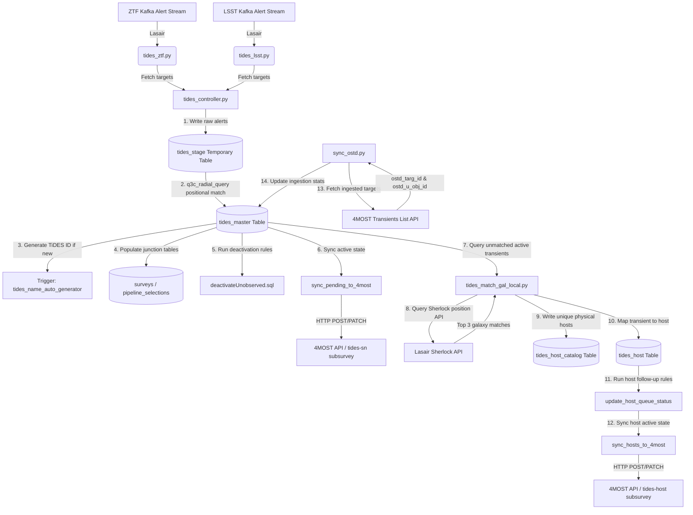
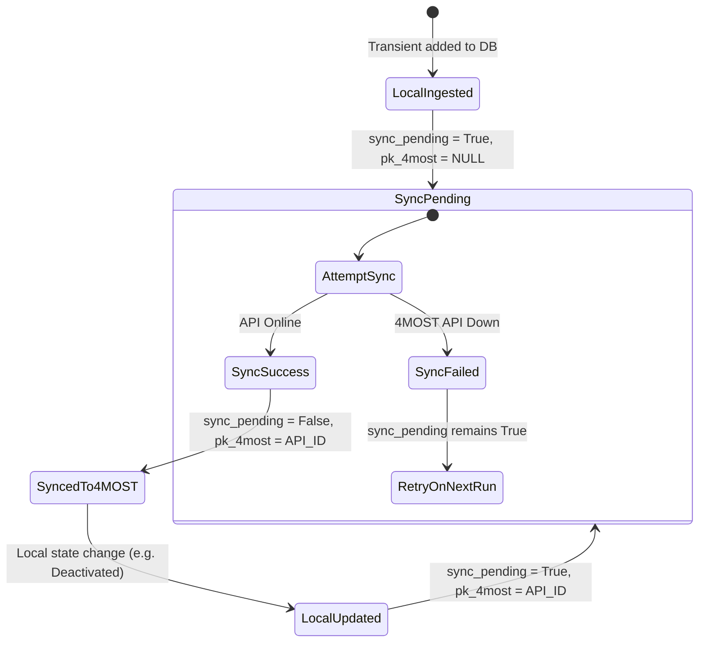

# The Ultimate User Guide to the tides-ingest Pipeline

Welcome to the ultimate, comprehensive guide to the **TiDES Ingest and Orchestration Pipeline** (`tides-ingest`). This document is a complete technical manual detailing the architecture, database schemas, transient ingestion flows, host galaxy matching algorithms, and external API integrations for the Time-Domain Extragalactic Survey (TiDES).

---

## Table of Contents
1. [Executive Overview & System Architecture](#1-executive-overview--system-architecture)
2. [Database Architecture & Schema Reference](#2-database-architecture--schema-reference)
3. [Transient Ingestion Pipeline (`tides_controller.py`)](#3-transient-ingestion-pipeline)
4. [Host Galaxy Matching & Follow-up Queue (`tides_match_gal_local.py`)](#4-host-galaxy-matching--follow-up-queue)
5. [4MOST API Integration & State Sync (`submit_transients.py` & `sync_ostd.py`)](#5-4most-api-integration--state-sync)
6. [Operations & Deployment Reference](#6-operations--deployment-reference)
7. [Verification & Testing Framework](#7-verification--testing-framework)

---

## 1. Executive Overview & System Architecture

The TiDES communication and ingestion pipeline orchestrates the discovery, cross-matching, database ingestion, and 4MOST target queue allocation of extragalactic transients (such as supernovae) and their host galaxies. 

The pipeline is built around a centralized PostgreSQL relational database utilizing the **Q3C spatial indexing extension** for sub-arcsecond astronomical coordinate cross-matching. The workflow is orchestrated using **Prefect** workflows.

### High-Level Data Flow

The system acts as a bridge between external alert streams, the local target database, and the **4MOST target submission API**. It routes targets depending on their classification:
- **Transients (Active Supernovae)** are queued for spectroscopic classification/monitoring.
- **Host Galaxies** are queued for follow-up spectroscopy *only* after the associated transient has faded, ensuring the bright transient light does not contaminate the galaxy's physical host spectrum.

The following Mermaid diagram visualizes the end-to-end flow:



### Key Integrations
1. **Lasair (Kafka Streams & Sherlock API)**: Connects to ZTF and LSST public alert brokers, fetches the latest transient alerts, and performs Sherlock classification query cross-matches.
2. **4MOST Web Interface Target Cat API**: Submits and updates active targets under the `"tides-sn"` and `"tides-host"` subsurveys.
3. **4MOST OSTD (Operational Survey Target Database)**: Syncs newly assigned target/object IDs back to the local database to preserve data provenance.

---

## 2. Database Architecture & Schema Reference

All tables are designed to support deduplication, multiple astronomical survey memberships, and state tracking. Spatial coordinates (`ra`, `dec`) are indexed using the Q3C (Quad Tree Cube) extension for rapid radial queries.

### Entity Relationship Diagram

The database uses a clean, normalized relational model:

```mermaid
erDiagram
    TIDES_MASTER ||--o{ SURVEYS : "is observed by"
    SURVEY_IDS ||--o{ SURVEYS : "identifies"
    TIDES_MASTER ||--o{ PIPELINE_SELECTIONS : "is selected by"
    PIPELINES ||--o{ PIPELINE_SELECTIONS : "identifies selection method"
    TIDES_MASTER ||--o{ TIDES_HOST : "maps transient"
    TIDES_HOST_CATALOG ||--o{ TIDES_HOST : "identifies physical galaxy"
    PIPELINES ||--o{ TIDES_HOST : "tracks matching method"

    TIDES_MASTER {
        bigserial tides_id PK
        bigint pk_4most
        bigint ostd_targ_id
        bigint ostd_u_obj_id
        text name UNIQUE
        double_precision ra
        double_precision dec
        double_precision jdmin
        double_precision jdmax
        double_precision jd_obs_trigger
        jsonb latest_mags
        jsonb latest_mjd
        jsonb n_sources
        boolean active
        boolean sync_pending
        timestamp date_ingested
        timestamp created
        timestamp updated
    }

    SURVEY_IDS {
        varchar survey_name
        integer survey_id PK
    }

    SURVEYS {
        bigint tides_id PK, FK
        varchar transient_name
        integer source_survey_id PK, FK
    }

    PIPELINES {
        serial pipeline_id PK
        varchar pipeline_name
        varchar version
    }

    PIPELINE_SELECTIONS {
        bigint tides_id PK, FK
        integer source_survey_id PK, FK
        integer pipeline_id PK, FK
        timestamp selection_time
    }

    TIDES_HOST_CATALOG {
        bigserial host_id PK
        varchar host_name UNIQUE
        double_precision ra
        double_precision dec
        jsonb mag
    }

    TIDES_HOST {
        bigserial association_id PK
        bigint tides_id FK
        bigint host_id FK
        integer rank
        integer selection_fn FK
        jsonb metadata
        bigint pk_4most
        boolean sync_pending
        boolean active
    }
```

### Table Definitions

#### 1. `tides_master`
Stores unique transient alerts resolved across all source surveys.
- **SQL File**: [createMasterTable.sql](database_setup/createMasterTable.sql)
- **Schema Columns**:
  - `tides_id` (`BIGSERIAL PRIMARY KEY`): Unique internal identifier.
  - `pk_4most` (`BIGINT DEFAULT NULL`): The 4MOST API primary key.
  - `ostd_targ_id` / `ostd_u_obj_id` (`BIGINT DEFAULT NULL`): 4MOST OSTD database IDs.
  - `name` (`TEXT UNIQUE`): Unique name generated by the trigger function (e.g., `TiDES26abc`).
  - `ra`, `dec` (`double precision`): Sky coordinates in decimal degrees.
  - `jdmin`, `jdmax` (`double precision`): First and latest detection Julian dates.
  - `jd_obs_trigger` (`double precision`): Julian date when observation was triggered.
  - `latest_mags` (`JSONB DEFAULT '{}'`): Dict of the latest magnitude per filter map (e.g. `{"g_lsst": 21.4, "r_ztf": 19.8}`).
  - `latest_mjd` (`JSONB DEFAULT '{}'`): Dict mapping filters to the MJD of their latest detection.
  - `n_sources` (`JSONB DEFAULT '{}'`): Dict mapping filters to their cumulative detection count.
  - `active` (`BOOL DEFAULT FALSE`): Whether the transient is active and should be observed.
  - `sync_pending` (`BOOL DEFAULT TRUE`): Flags whether changes need to be synced to the 4MOST API.
  - `date_ingested` (`TIMESTAMP WITH TIME ZONE DEFAULT NULL`): The ingestion date returned by 4MOST.
  - `created` / `updated` (`TIMESTAMP WITH TIME ZONE`): Audit timestamps.

#### 2. `tides_host_catalog`
Stores unique physical host galaxies, deduplicated by name.
- **SQL File**: [createHostTable.sql](database_setup/createHostTable.sql)
- **Schema Columns**:
  - `host_id` (`BIGSERIAL PRIMARY KEY`): Auto-incrementing unique host identifier.
  - `host_name` (`VARCHAR UNIQUE NOT NULL`): The main catalog ID returned by Sherlock (e.g. SDSS/NED/SIMBAD IDs).
  - `ra`, `dec` (`double precision NOT NULL`): Coordinates of the galaxy core.
  - `mag` (`JSONB`): Magnitude metadata containing filter, value, and error (e.g., `{"Mag": 18.5, "MagErr": 0.1, "MagFilter": "g"}`).

#### 3. `tides_host`
Maps transients to host galaxy candidates and tracks their 4MOST queue states.
- **SQL File**: [createHostTable.sql](database_setup/createHostTable.sql)
- **Schema Columns**:
  - `association_id` (`BIGSERIAL PRIMARY KEY`): Unique primary key.
  - `tides_id` (`BIGINT REFERENCES tides_master`): Link to the transient.
  - `host_id` (`BIGINT REFERENCES tides_host_catalog`): Link to the host galaxy.
  - `rank` (`INT CHECK (rank >= 1 AND rank <= 3)`): Proximity rank (top 3 candidate matches).
  - `selection_fn` (`INT REFERENCES pipelines`): Link to the matching pipeline version run.
  - `metadata` (`JSONB`): Separation, classification reliability, redshift info, etc.
  - `pk_4most` (`BIGINT DEFAULT NULL`): The host's registered 4MOST target ID.
  - `sync_pending` (`BOOLEAN DEFAULT FALSE`): Set to `True` when activation/deactivation changes need to be sent to 4MOST.
  - `active` (`BOOLEAN DEFAULT FALSE`): Active status in the 4MOST target queue.

#### 4. `surveys` and `survey_ids`
`survey_ids` is a static metadata catalog. `surveys` maps the native survey names to the internal `tides_id` to allow multiple external IDs to resolve to a single physical transient.
- **SQL Files**: [surveyIDs.sql](database_setup/surveyIDs.sql), [surveyConnector.sql](database_setup/surveyConnector.sql)
- **Static IDs**:
  - `1`: `LSST` | `2`: `ZTF` | `3`: `LS4` | `4`: `4MOST` | `5`: `ATLAS` | `6`: `GOTO` | `7`: `HSC` | `8`: `BlackGEM` | `9`: `TNS`.

#### 5. `pipelines` and `pipeline_selections`
Maintains pipeline run metadata (`pipeline_id`, `pipeline_name`, `version`) and logs when a specific pipeline select version recorded a transient.
- **SQL Files**: [pipelines.sql](database_setup/pipelines.sql), [pipelineSelections.sql](database_setup/pipelineSelections.sql)

---

### Astronomical Coordinate Indexing (Q3C)

Coordinates in `tides_master` and `tides_host_catalog` are indexed using the Q3C (Quad Tree Cube) plugin:
```sql
CREATE INDEX IF NOT EXISTS idx_tides_master_ra_dec ON tides_master (q3c_ang2ipix(ra, dec));
CREATE INDEX IF NOT EXISTS idx_tides_host_catalog_ra_dec ON tides_host_catalog (q3c_ang2ipix(ra, dec));
```
This enables extremely fast sub-arcsecond positional searches using `q3c_radial_query(ts.ra, ts.dec, tm.ra, tm.dec, <degrees>)`.

---

### Target Naming Conventions & SQL Trigger

New transients do not use external naming schemes. Instead, a custom PL/pgSQL database trigger automatically allocates a sequential, annual name.
- **Trigger Name**: `tides_name_auto_generator`
- **Pattern**: `TiDES` + `YY` (2-digit year) + `alpha_seq` (sequential letters) e.g., `TiDES26aaa`.
- **Letters Sequence Generator**:
  - `0 - 17,575`: 3-letter sequence (`aaa` to `zzz`).
  - `17,576 - 474,551`: 4-letter sequence (`aaaa` to `zzzz`).
- **Yearly Sequence Reset**: When the current year changes relative to the last recorded transient, the sequence `tides_seq` is automatically reset to `0`.

```sql
CREATE OR REPLACE FUNCTION trg_fn_generate_tides_name() RETURNS TRIGGER AS $$
DECLARE
    current_yy text := to_char(current_date, 'YY');
    last_yy text;
BEGIN
    SELECT substring(name from 6 for 2) INTO last_yy FROM tides_master ORDER BY tides_id DESC LIMIT 1;
    IF last_yy IS NOT NULL AND last_yy != current_yy THEN
        PERFORM setval('tides_seq', 0, false);
    END IF;
    NEW.name := 'TiDES' || current_yy || to_dynamic_alpha(nextval('tides_seq')::int);
    RETURN NEW;
END;
$$ LANGUAGE plpgsql;
```

---

## 3. Transient Ingestion Pipeline

The transient ingestion is orchestrated by the `run_target_workflow` Prefect flow in [tides_controller.py](tides_flows/tides_controller.py).

### 1. Ingestion Flow Steps

1. **Load Credentials**: Reads database and API configurations from the environment.
2. **Stream Fetching**: Calls survey plugin functions in parallel or sequence:
   - `fetch_lsst_targets()` ([tides_lsst.py](tides_flows/tides_lsst.py))
   - `fetch_ztf_targets()` ([tides_ztf.py](tides_flows/tides_ztf.py))
3. **Data standardisation**: Each plugin processes raw JSON alerts into standard DataFrames containing the required contract columns:
   - `object_id`, `survey_id`, `pipeline_id`, `ra`, `dec`, `jdmin`, `jdmax`, `latest_filter`, `latest_mag`, `n_sources`.
4. **Temporary Staging**: Inserts alerts into a temporary SQL table `tides_stage`.
5. **Cross-Matching & Upsert**: Executes [upsertTiDESstage.sql](sql_tasks/upsertTiDESstage.sql).
6. **Deactivation**: Evaluates faded transients via [deactivateUnobserved.sql](sql_tasks/deactivateUnobserved.sql).
7. **4MOST Sync**: Syncs all changed states to the external 4MOST target system.
8. **Ingest Report**: Creates a Markdown Prefect artifact highlighting additions, updates, and deactivations.

---

### 2. Spatial Cross-Matching Logic (`upsertTiDESstage.sql`)

When transients are staged, the database cross-matches them against `tides_master` using a **1-arcsecond radius** ($0.000277778$ degrees):

- **If matching transient is NOT found**: 
  - Inserts a new row into `tides_master`.
  - The name trigger assigns a new `TiDES` identifier.
  - Inserts mappings into `surveys` and `pipeline_selections`.
- **If matching transient IS found**:
  - Updates the existing row.
  - Updates the maximum Julian date: `jdmax = GREATEST(tm.jdmax, ts.jdmax)`.
  - Reactivates the target if it was previously dead: `active = True`, `sync_pending = True` (if `tm.active` was `False`).
  - Merges new magnitude metadata into the JSONB dictionary without overwriting other band keys:
    ```sql
    latest_mags = COALESCE(tm.latest_mags, '{}'::jsonb) || ts.latest_mag::jsonb
    latest_mjd = COALESCE(tm.latest_mjd, '{}'::jsonb) || ts.latest_filter::jsonb
    n_sources = COALESCE(tm.n_sources, '{}'::jsonb) || ts.n_sources::jsonb
    ```

---

### 3. Transient Deactivation Rules

Transients are highly dynamic, fading over time. To release telescope resources, the controller executes the SQL script [deactivateUnobserved.sql](sql_tasks/deactivateUnobserved.sql) at the end of each run. 

An active transient is updated to `active = False` and `sync_pending = True` if it meets **either** of the following:
1. **Unobserved (Database Timeout)**: The record in `tides_master` has not been updated in the database for 5 days:
   `updated < now() - interval '5 days'`
2. **Faded (Magnitude threshold)**: The transient has magnitude detections, but **all** recorded filters are fainter than 22.5 mag:
   ```sql
   NOT EXISTS (
       SELECT 1 FROM jsonb_each_text(latest_mags)
       WHERE value::numeric <= 22.5
   )
   ```

---

## 4. Host Galaxy Matching & Follow-up Queue

Orchestrated by the Prefect flow `match_galaxies_flow` in [tides_match_gal_local.py](host_tools/tides_host_matching/tides_match_gal_local.py).

### 1. Sherlock Query and Candidate Selection

For active transients in the database that do not have host associations, the pipeline:
1. Queries the **Lasair Sherlock Position API** using the transient's `ra` and `dec`.
2. Filters the cross-match results to only keep matches where `catalogue_object_type = 'galaxy'`.
3. Selects up to the **top 3** closest galaxy candidates and registers their association.

### 2. Catalog Deduplication

Galaxies are saved exactly once in `tides_host_catalog` under a unique catalog name (`host_name`, SDSS/NED identifier). Multiple transients occurring in the same host galaxy will map back to the same `host_id` inside `tides_host`, preventing duplicate telescope targets.

---

### 3. Host Follow-up Queue Rules

The follow-up status of a host galaxy in `tides_host` (`active` column) is evaluated programmatically based on the active state of its associated transient. **A host is queued for follow-up spectroscopy ONLY when the transient is inactive** to avoid light contamination from the transient.

#### Follow-Up Queue Scenarios

| Scenario | Transient Active Status (`tides_master.active`) | Transient Age / Magnitude Conditions | Host Target Queue Status (`tides_host.active`) |
| :--- | :--- | :--- | :--- |
| **Scenario 1** | `True` (Active) | *Any* | `False` (Not queued) |
| **Scenario 2** | `False` (Inactive) | Unobserved for $>50$ days (`(MJD_now - jdmax) > 50`) | `True` (Queued) |
| **Scenario 3** | `False` (Inactive) | Observed recently, but **all** LSST filter detections are fainter than 24 mag | `True` (Queued) |
| **Scenario 4** | `False` (Inactive) | Observed recently, and has a bright LSST detection $\le 24$ mag | `False` (Not queued) |

This logic is evaluated as a single SQL query:
```sql
CASE 
    WHEN tm.active = False AND (
        ((extract(epoch from clock_timestamp())/86400.0 + 40587.0) - tm.jdmax) > 50
        OR (
            EXISTS (SELECT 1 FROM jsonb_each_text(tm.latest_mags) WHERE key LIKE '%_lsst')
            AND NOT EXISTS (SELECT 1 FROM jsonb_each_text(tm.latest_mags) WHERE key LIKE '%_lsst' AND value::numeric <= 24)
        )
    ) THEN True
    ELSE False
END
```

---

### 4. Host 4MOST Target Parameters

When a host galaxy is submitted to 4MOST, it is registered under specific survey templates:
- **Subsurvey**: `tides-host`
- **Ruleset**: `tides_hostsMay2024`
- **Classification**: `GAL`
- **Template**: `SF_col00pt780_mass09pt88_sfr02pt00_z00pt225.fits`
- **Extent Flag**: `1` (identifies target as extended, unlike stellar or point-source transients).

---

## 5. 4MOST API Integration & State Sync

The pipeline interacts with the RESTful 4MOST transients API via the utility module [submit_transients.py](tides_flows/submit_transients.py).

### 1. API Actions (CRUD)

- **Create**: Calls `create_transient(data=payload)` via HTTP `POST`. Returns the assigned unique 4MOST primary key (`id`).
- **Update / Deactivate**: Calls `update_transient(pk=id, data=payload)` via HTTP `PATCH` (e.g. to modify target activity).
- **Delete**: Calls `delete_transient(pk=id)` via HTTP `DELETE` (only permitted prior to target ingestion).

---

### 2. State Machine & API Downtime Fallback

If the 4MOST API endpoint is unreachable or down, the ingestion flow is designed to complete successfully without dropping transient data. This is governed by a state machine on the `sync_pending` boolean:



When 4MOST returns online, the next pipeline run automatically queries all `sync_pending = True` targets, uploads new registrations, patches changed active states, and updates `sync_pending = False`.

---

### 3. 4MOST OSTD Target Synchronization

The 4MOST system schedules targets by pulling them from the API and ingesting them into the OSTD (Operational Survey Target Database). The OSTD assigns its own tracking IDs.

The script [sync_ostd.py](db_4MOST_tasks/sync_ostd.py) runs as a periodic Prefect flow. It retrieves the latest OSTD ingest details and updates local records:
1. **Timestamp Check**: Queries `MAX(date_ingested)` from `tides_master` to find the last sync point.
2. **Fetch Ingested Targets**: Queries the 4MOST transients list endpoint with `date_ingested__gt=<last_timestamp>` to fetch newly OSTD-ingested records.
3. **Database Update**: Matches targets on `pk_4most = id` and records:
   - `ostd_targ_id`: The 4MOST OSTD target ID.
   - `ostd_u_obj_id`: The 4MOST OSTD unique object ID.
   - `date_ingested`: The timestamp when the target entered the OSTD.

---

## 6. Operations & Deployment Reference

### Environment Variables (.env)

Define these variables in your root `.env` file (see [.env.example](.env.example)):
```env
# Local Database Connection
TIDES_DB_USER='tidesadmin'
TIDES_DB_PASS='databasepassword'
TIDES_DB_DATABASE='dopr4_tides'
TIDES_DB_HOST='127.0.0.1'
TIDES_DB_PORT='5432'

# Testing Database
TIDES_TEST_DB_DATABASE='dopr4_tides_test'

# Lasair Streaming API Tokens
LASAIR_LSST_TOKEN='lasair_lsst_stream_token'
LASAIR_ZTF_TOKEN='lasair_ztf_stream_token'

# 4MOST API Access
FOURMOST_USERNAME='your_4most_api_username'
FOURMOST_PASSWORD='your_4most_api_password'
FOURMOST_SCHEMA='https://4most.mpe.mpg.de/QFSwi/targetCat/transients/'
FOURMOST_ACCESS_TOKEN='your_4most_access_token'
```

### Database Initialization

To set up the database schema from scratch:
```bash
cd database_setup
./setupDB.sh
```
This script executes the SQL tables and trigger creations in the correct dependency order.

### Orchestration Commands

#### 1. Execute Transient Pipeline Locally
To run the ingestion controller manually:
```bash
python tides_flows/tides_controller.py
```

#### 2. Execute Host Matching Locally
To execute the galaxy matching locally (defaults to pipeline `sherlock`, version `v1.0`):
```bash
python host_tools/tides_host_matching/tides_match_gal_local.py
```

#### 3. Prefect Production Deployments
Deploy the flows to a Prefect work pool to automate periodic runs:
```bash
# Register Ingestion Flow
prefect deployment build -n tides-ingest -p default -q default tides_flows/tides_controller.py:run_target_workflow
prefect deployment apply run_target_workflow-deployment.yaml

# Register Galaxy Matching Flow
prefect deployment build -n tides-galaxy-matching -p default host_tools/tides_host_matching/tides_match_gal_local.py:match_galaxies_flow
prefect deployment apply match_galaxies_flow-deployment.yaml

# Register OSTD Ingest Sync Flow
prefect deployment build -n tides-ostd-sync -p default db_4MOST_tasks/sync_ostd.py:sync_ostd_flow
prefect deployment apply sync_ostd_flow-deployment.yaml
```

---

## 7. Verification & Testing Framework

Comprehensive integration tests are located in the [testing](testing/) directory.

### 1. Deterministic Test Mode (Mock Streams)

To test the spatial matching, staging, and DB upsert logic without needing live Kafka network streams, the controller can be executed in `test_mode`.

1. Open [tides_controller.py](tides_flows/tides_controller.py) and ensure `test_mode=True` is enabled at the entry point:
   ```python
   if __name__ == "__main__":
       run_target_workflow(connect_db=True, test_mode=True)
   ```
2. Run the script:
   ```bash
   python tides_flows/tides_controller.py
   ```
   This pulls mock transients defined in [mock_streams.py](testing/mock_streams.py) (including spatial overlaps to test the 1-arcsecond deduplication logic).

---

### 2. Host Matching & Queue Integration Test

Verifies Sherlock galaxy identification, host cataloging, and follow-up queue logic across all 4 target scenarios.
```bash
python testing/test_host_matching.py
```
This test:
1. Performs a database wipe of the test database.
2. Inserts active transients and triggers host matching.
3. Transitions transients to active/inactive states corresponding to Scenarios 1-4.
4. Executes the queue evaluation.
5. Asserts the database states match the expected follow-up logic.

---

### 3. 4MOST API Downtime resilience Integration Test

Verifies the robustness of the pipeline when the 4MOST API endpoint goes offline.
```bash
python testing/test_4most_downtime.py
```
This test:
1. Connects to the test database and wipes existing records.
2. Temporarily overrides the 4MOST schema endpoint with a bogus URL (`https://invalid-host-4most-down.mpe.mpg.de/`).
3. Runs the transient ingestion flow. Confirms that local database ingest completes successfully and sets `sync_pending = True` with `pk_4most = NULL` for all new transients.
4. Restores the actual 4MOST API URL and triggers the sync workflow.
5. Confirms that all pending records are successfully updated and registered, clearing `sync_pending` to `False` and saving the returned API IDs.
